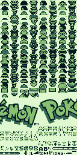
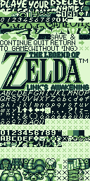
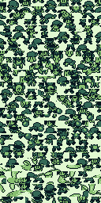

# Game Boy ROM Viewer

   

This program interprets an entire Game Boy ROM as graphics in its native 2 bits-per-pixel color format and renders an output image. It was developed as part of my larger work in Game Boy emulation and development.

## Usage
```
gbromviewer [-o rom.png] [-tw 16] rom.gb
```
Where `-o` specifies the output image and `-tw` specifies the width of the output image in tiles (default 16).

## What is all the nonsense static in the image?
That's the game code! Only some of the ROM is graphics data, but this program can't tell which, so it displays everything.

## Why does game xyz not show the graphics I'm expecting?
The graphics may be compressed, so they aren't stored in the ROM the same way they're loaded into VRAM at runtime for displaying on the Game Boy's screen. This program isn't sophisticated enough to deal with that.

The graphics may also not be "aligned" with the beginning of the ROM. This program assumes each 16 bytes of the ROM make up a tile, but if the graphics data is offset by some number of bytes and doesn't start at an address evenly divisible by 16, they will not be processed correctly. (TODO: add offset option for this?)

## Does it support Game Boy Color ROMs?
Kinda...! Try one and see. Some graphics load, but there may be something more to Game Boy Color tile data. I haven't gotten there yet.

## References + thanks to
* https://www.huderlem.com/demos/gameboy2bpp.html
* http://imrannazar.com/GameBoy-Emulation-in-JavaScript:-Graphics